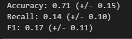
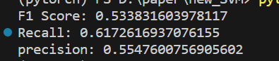

# Voxel-wise prediction of recurrent high grade glioma via proximity estimation coupled multi-dimensional SVM 复现

## 复现过程

* 我根据对背景进行处理，留下了绿色区域与蓝色区域
* 剔除了绿色区域较小的样本
  * 剔除规则是：`绿色区域/蓝色区域 > 20%`
* 根据 `target` 将每个像素五个模态的值与目标组成一行数据
  * 蓝色区域：0；绿色区域：1
* 写入`.txt` 文件里面
* 对数据进行清洗
  * 清洗数据：删除五个模态值中包含 0 的数据
* 根据 `kernel="rbf", gamma=2, C=100,` 去进行训练。

结果如下：



结果比较不理想。

## 学习

### sklearnex 加速

参考网址：https://www.cnblogs.com/feffery/p/16387854.html

`scikit-learn`作为经典的机器学习框架，但其运算速度比较慢。借助 `sklearnex` 可以对运算速度有一定的提高。

步骤：

1. 安装相关库

```shell
pip install scikit-learn scikit-learn-intelex  -i https://pypi.douban.com/simple/
```

2. 相关代码

```python
from sklearnex import patch_sklearn, unpatch_sklearn
patch_sklearn()
```

### 处理数据

该篇论文的复现核心就是对五个模态数据进行标记，蓝色区域标记成 `0` ，绿色区域标记成 `1`，送入`SVM` 模型进行训练。

`target` 图片（实际上是`01`值二维矩阵）如下：


如何处理数据会极大影响训练后的结果。他的处理方式如下：

* 对 `target` 二维矩阵，获取 `max_x`、`max_y`、`min_x`、`min_y`
* 以这两个坐标所构成的矩阵的区域，去获取相对应区域 `target`数据
* 以这两个坐标所构成的矩阵的区域，去获取相对应区域五个模态组成的矩阵数据
* 为了后续计算方便，将该区域设置最大的范围 `[100,100]`

结果相对于上面一种较好，结果如下：



> 注：`max_iter=20000`

## 问题

1. 如果不设置 `max_iter` 那么就会一直训练（至少是3个小时以上了）
2. 有段代码没理解他的含义。

```python
multi_modal_data[:, :, :, multi_index] = (multi_modal_data[:, :, :, multi_index] * data)
```

