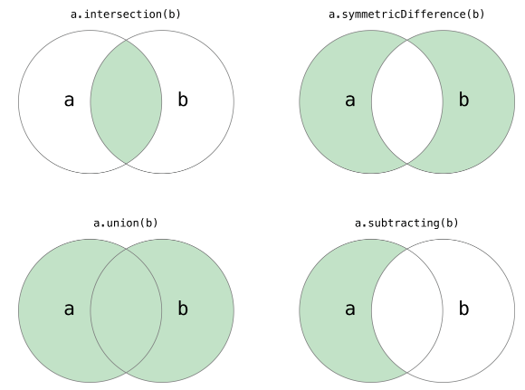

# 基础学习

## 1. 变量

常见数据类型：

* 整型：Python中可以处理任意大小的整数。
* 浮点型：浮点数也就是小数。
* 字符串型：字符串是以单引号或双引号括起来的任意文本。
* 布尔型：布尔值只有`True`、`False`两种值，要么是`True`，要么是`False`。
* 复数型：形如`3+5j`，跟数学上的复数表示一样，唯一不同的是虚部的`i`换成了`j`。

变量命名：

* 硬性规则：
  * 变量名由字母（广义的Unicode字符，不包括特殊字符）、数字和下划线构成，数字不能开头。
  * 大小写敏感（大写的`a`和小写的`A`是两个不同的变量）。
  * 不要跟关键字（有特殊含义的单词，后面会讲到）和系统保留字（如函数、模块等的名字）冲突。
* PEP 8要求：
  * 用小写字母拼写，多个单词用下划线连接。
  * 受保护的实例属性用单个下划线开头。
  * 私有的实例属性用两个下划线开头。

运算符：（按照优先级从高到低的顺序列出了所有的运算符）

| 运算符                                                       | 描述                           |
| ------------------------------------------------------------ | ------------------------------ |
| `[]` `[:]`                                                   | 下标，切片                     |
| `**`                                                         | 指数                           |
| `~` `+` `-`                                                  | 按位取反, 正负号               |
| `*` `/` `%` `//`                                             | 乘，除，模，整除               |
| `+` `-`                                                      | 加，减                         |
| `>>` `<<`                                                    | 右移，左移                     |
| `&`                                                          | 按位与                         |
| `^` `|`                                                      | 按位异或，按位或               |
| `<=` `<` `>` `>=`                                            | 小于等于，小于，大于，大于等于 |
| `==` `!=`                                                    | 等于，不等于                   |
| `is`  `is not`                                               | 身份运算符                     |
| `in` `not in`                                                | 成员运算符                     |
| `not` `or` `and`                                             | 逻辑运算符                     |
| `=` `+=` `-=` `*=` `/=` `%=` `//=` `**=` `&=` `|=``^=``>>=``<<=` | （复合）赋值运算符             |

## 2. 基本语句

if：

```python
x = float(input('x = '))
if x > 1:
    y = 3 * x - 5
else:
    if x >= -1:
        y = x + 2
    else:
        y = 5 * x + 3
print('f(%.2f) = %.2f' % (x, y))
```

for… in…：

```python
sum = 0
for x in range(1, 101):
    if x % 2 == 0:
        sum += x
print(sum)
```

`range`函数参数：

* start: 计数从 start 开始。默认是从 0 开始。例如range（5）等价于range（0， 5）;
* stop: 计数到 stop 结束，**但不包括 stop**。例如：range（0， 5） 是[0, 1, 2, 3, 4]没有5
* step：步长，默认为1。例如：range（0， 5） 等价于 range(0, 5, 1)

while：

```python
while True:
    counter += 1
    number = int(input('请输入: '))
    if number < answer:
        print('大一点')
    elif number > answer:
        print('小一点')
    else:
        print('恭喜你猜对了!')
        break
```

## 3. 函数

使用 `def` 来定义函数，接下来写函数名称,命名规则跟变量的命名规则是一致的。，括号里面写函数参数。函数内部用 `return` 返回值。

```python
def fac(num):
    """求阶乘"""
    result = 1
    for n in range(1, num + 1):
        result *= n
    return result


m = int(input('m = '))
n = int(input('n = '))
# 当需要计算阶乘的时候不用再写循环求阶乘而是直接调用已经定义好的函数
print(fac(m) // fac(n) // fac(m - n))
```

在Python中，函数的参数可以有默认值，也支持使用可变参数。

```python
# 可变参数
def add(*args):
    total = 0
    for val in args:
        total += val
    return total
# 默认值
def add(a=0, b=0, c=0):
    """三个数相加"""
    return a + b + c
```

## 4.模块

在同一个.py文件中定义了两个同名函数，由于Python没有函数重载的概念，那么后面的定义会覆盖之前的定义，也就意味着两个函数同名函数实际上只有一个是存在的。我们利用模块来管理函数。

`module1.py`

```Python
def foo():
    print('hello, world!')
```

`module2.py`

```Python
def foo():
    print('goodbye, world!')
```

`test.py`

```Python
from module1 import foo

# 输出hello, world!
foo()

from module2 import foo

# 输出goodbye, world!
foo()
```

可以对模块设置别名。

```python
import module1 as m1
import module2 as m2

m1.foo()
m2.foo()
```

需要说明的是：当我们导入的模块除了定义函数之外还有可以执行代码，如果我们在模块中编写了执行代码，最好是将这些执行代码放入如下所示的条件中。

`module3.py`

```Python
def foo():
    pass


def bar():
    pass


# __name__是Python中一个隐含的变量它代表了模块的名字
# 只有被Python解释器直接执行的模块的名字才是__main__
if __name__ == '__main__':
    print('call foo()')
    foo()
    print('call bar()')
    bar()
```

`test.py`

```Python
import module3

# 导入module3时 不会执行模块中if条件成立时的代码 因为模块的名字是module3而不是__main__
```

## 5.数据结构

### 5.1.字符串

由零个或多个字符组成的有限序列，单个或多个字符用单引号或者双引号包围起来，就可以表示一个字符串。

相关操作如下：

```python
s1 = 'hello ' * 3
print(s1) # hello hello hello 
s2 = 'world'
s1 += s2
print(s1) # hello hello hello world
print('ll' in s1) # True
print('good' in s1) # False
str2 = 'abc123456'
# 从字符串中取出指定位置的字符(下标运算)
print(str2[2]) # c
# 字符串切片(从指定的开始索引到指定的结束索引)
print(str2[2:5]) # c12
print(str2[2:]) # c123456
print(str2[2::2]) # c246
print(str2[::2]) # ac246
print(str2[::-1]) # 654321cba
print(str2[-3:-1]) # 45

str1 = 'hello, world!'
# 通过内置函数len计算字符串的长度
print(len(str1)) # 13
# 获得字符串首字母大写的拷贝
print(str1.capitalize()) # Hello, world!
# 获得字符串每个单词首字母大写的拷贝
print(str1.title()) # Hello, World!
# 获得字符串变大写后的拷贝
print(str1.upper()) # HELLO, WORLD!
# 从字符串中查找子串所在位置
print(str1.find('or')) # 8
print(str1.find('shit')) # -1
# 与find类似但找不到子串时会引发异常
# print(str1.index('or'))
# print(str1.index('shit'))
# 检查字符串是否以指定的字符串开头
print(str1.startswith('He')) # False
print(str1.startswith('hel')) # True
# 检查字符串是否以指定的字符串结尾
print(str1.endswith('!')) # True
# 将字符串以指定的宽度居中并在两侧填充指定的字符
print(str1.center(50, '*'))
# 将字符串以指定的宽度靠右放置左侧填充指定的字符
print(str1.rjust(50, ' '))
str2 = 'abc123456'
# 检查字符串是否由数字构成
print(str2.isdigit())  # False
# 检查字符串是否以字母构成
print(str2.isalpha())  # False
# 检查字符串是否以数字和字母构成
print(str2.isalnum())  # True
str3 = '  jackfrued@126.com '
print(str3)
# 获得字符串修剪左右两侧空格之后的拷贝
print(str3.strip())

# 格式化
a, b = 5, 10
print('%d * %d = %d' % (a, b, a * b))
a, b = 5, 10
print('{0} * {1} = {2}'.format(a, b, a * b))
a, b = 5, 10
print(f'{a} * {b} = {a * b}')
```

### 5.2.列表

是值的有序序列，每个值都可以通过索引进行标识，定义列表可以将列表的元素放在`[]`中，多个元素用`,`进行分隔。

相关操作如下：

```python
f = [x for x in range(1, 10)]
print(f)
f = [x + y for x in 'ABCDE' for y in '1234567']
print(f)
# 用列表的生成表达式语法创建列表容器
# 用这种语法创建列表之后元素已经准备就绪所以需要耗费较多的内存空间
f = [x ** 2 for x in range(1, 1000)]
print(sys.getsizeof(f))  # 查看对象占用内存的字节数
print(f)
# 请注意下面的代码创建的不是一个列表而是一个生成器对象
# 通过生成器可以获取到数据但它不占用额外的空间存储数据
# 每次需要数据的时候就通过内部的运算得到数据(需要花费额外的时间)
f = (x ** 2 for x in range(1, 1000))
print(sys.getsizeof(f))  # 相比生成式生成器不占用存储数据的空间
print(f)
for val in f:
    print(val)
```

```python
list1 = [1, 3, 5, 7, 100]
print(list1) # [1, 3, 5, 7, 100]
# 乘号表示列表元素的重复
list2 = ['hello'] * 3
print(list2) # ['hello', 'hello', 'hello']
# 计算列表长度(元素个数)
print(len(list1)) # 5
# 下标(索引)运算
print(list1[0]) # 1
print(list1[4]) # 100
# print(list1[5])  # IndexError: list index out of range
print(list1[-1]) # 100
print(list1[-3]) # 5

# 切片操作
fruits = ['grape', 'apple', 'strawberry', 'waxberry']
fruits += ['pitaya', 'pear', 'mango']
# 列表切片
fruits2 = fruits[1:4]
print(fruits2) # apple strawberry waxberry
# 可以通过完整切片操作来复制列表
fruits3 = fruits[:]
print(fruits3) # ['grape', 'apple', 'strawberry', 'waxberry', 'pitaya', 'pear', 'mango']
fruits4 = fruits[-3:-1]
print(fruits4) # ['pitaya', 'pear']
# 可以通过反向切片操作来获得倒转后的列表的拷贝
fruits5 = fruits[::-1]
print(fruits5) # ['mango', 'pear', 'pitaya', 'waxberry', 'strawberry', 'apple', 'grape']
```

```python
# 通过for循环遍历列表元素
for elem in list1:
    print(elem)
# 通过enumerate函数处理列表之后再遍历可以同时获得元素索引和值
for index, elem in enumerate(list1):
    print(index, elem)
    
# CURD操作
list1 = [1, 3, 5, 7, 100]
# 添加元素
list1.append(200)
list1.insert(1, 400)
# 合并两个列表
# list1.extend([1000, 2000])
list1 += [1000, 2000]
print(list1) # [1, 400, 3, 5, 7, 100, 200, 1000, 2000]
print(len(list1)) # 9
# 先通过成员运算判断元素是否在列表中，如果存在就删除该元素
if 3 in list1:
 list1.remove(3)
if 1234 in list1:
    list1.remove(1234)
print(list1) # [1, 400, 5, 7, 100, 200, 1000, 2000]
# 从指定的位置删除元素
list1.pop(0)
list1.pop(len(list1) - 1)
print(list1) # [400, 5, 7, 100, 200, 1000]
# 清空列表元素
list1.clear()
print(list1) # []
```

### 5.3.元组

==元组的元素不能修改==。用括号把多个元素组合到一起就形成了一个元组，

相关操作如下：

```python
# 定义元组
t = ('骆昊', 38, True, '四川成都')
print(t)
# 获取元组中的元素
print(t[0])
print(t[3])
# 遍历元组中的值
for member in t:
    print(member)
# 重新给元组赋值
# t[0] = '王大锤'  # TypeError
# 变量t重新引用了新的元组原来的元组将被垃圾回收
t = ('王大锤', 20, True, '云南昆明')
print(t)
# 将元组转换成列表
person = list(t)
print(person)
# 列表是可以修改它的元素的
person[0] = '李小龙'
person[1] = 25
print(person)
# 将列表转换成元组
fruits_list = ['apple', 'banana', 'orange']
fruits_tuple = tuple(fruits_list)
print(fruits_tuple)
```

### 5.4.集合

Python中的集合跟数学上的集合是一致的，不允许有重复元素，而且可以进行交集、并集、差集等运算。



```python
# 创建集合的字面量语法
set1 = {1, 2, 3, 3, 3, 2}
print(set1)
print('Length =', len(set1))
# 创建集合的构造器语法(面向对象部分会进行详细讲解)
set2 = set(range(1, 10))
set3 = set((1, 2, 3, 3, 2, 1))
print(set2, set3)
# 创建集合的推导式语法(推导式也可以用于推导集合)
set4 = {num for num in range(1, 100) if num % 3 == 0 or num % 5 == 0}
print(set4)
```

```python
set1.add(4)
set1.add(5)
# 合并两个集合，重复元素只会出现一次：
set2.update([11, 12])
# 用于移除指定的集合元素。
set2.discard(5)
# 用于移除集合中的指定元素。
if 4 in set2:
    set2.remove(4)
print(set1, set2)
print(set3.pop())
print(set3)
```

集合的成员、交集、并集、差集等运算。

```Python
# 集合的交集、并集、差集、对称差运算
print(set1 & set2)
# print(set1.intersection(set2))
print(set1 | set2)
# print(set1.union(set2))
print(set1 - set2)
# print(set1.difference(set2))
print(set1 ^ set2)
# print(set1.symmetric_difference(set2))
# 判断子集和超集
print(set2 <= set1)
# print(set2.issubset(set1))
print(set3 <= set1)
# print(set3.issubset(set1))
print(set1 >= set2)
# print(set1.issuperset(set2))
print(set1 >= set3)
# print(set1.issuperset(set3))
```

### 5.5.字典

是一种可变容器模型，它可以存储任意类型对象，字典的每个元素都是由一个键和一个值组成的“键值对”，键和值通过冒号分开。

相关操作如下：

```python
# 创建字典的字面量语法
scores = {'骆昊': 95, '白元芳': 78, '狄仁杰': 82}
print(scores)
# 创建字典的构造器语法
items1 = dict(one=1, two=2, three=3, four=4)
# 通过zip函数将两个序列压成字典
items2 = dict(zip(['a', 'b', 'c'], '123'))
# 创建字典的推导式语法
items3 = {num: num ** 2 for num in range(1, 10)}
print(items1, items2, items3)
# 通过键可以获取字典中对应的值
print(scores['骆昊'])
print(scores['狄仁杰'])
# 对字典中所有键值对进行遍历
for key in scores:
    print(f'{key}: {scores[key]}')
# 更新字典中的元素
scores['白元芳'] = 65
scores['诸葛王朗'] = 71
scores.update(冷面=67, 方启鹤=85)
print(scores)
if '武则天' in scores:
    print(scores['武则天'])
print(scores.get('武则天'))
# get方法也是通过键获取对应的值但是可以设置默认值
print(scores.get('武则天', 60))
# 删除字典中的元素
print(scores.popitem())
print(scores.popitem())
print(scores.pop('骆昊', 100))
# 清空字典
scores.clear()
print(scores)
```

## 6.面向对象编程

### 6.1 封装

类是对象的蓝图和模板，而对象是类的实例。类是抽象的概念，而对象是具体的东西。

在面向对象编程的世界中，一切皆为对象，对象都有属性和行为，每个对象都是独一无二的，而且对象一定属于某个类（型）。当我们把一大堆拥有共同特征的对象的静态特征（属性）和动态特征（行为）都抽取出来后，就可以定义出一个叫做“类”的东西。

定义类：

```python
class Student(object):

    # __init__是一个特殊方法用于在创建对象时进行初始化操作
    # self 指的是传入的对象，或者操作的对象
    # 通过这个方法我们可以为学生对象绑定name和age两个属性
    def __init__(self, name, age):
        self.name = name
        self.age = age

    def study(self, course_name):
        print('%s正在学习%s.' % (self.name, course_name))

    # PEP 8要求标识符的名字用全小写多个单词用下划线连接
    # 但是部分程序员和公司更倾向于使用驼峰命名法(驼峰标识)
    def watch_movie(self):
        if self.age < 18:
            print('%s只能观看《熊出没》.' % self.name)
        else:
            print('%s正在观看岛国爱情大电影.' % self.name)
```

> **说明：** 写在类中的函数，我们通常称之为（对象的）方法，这些方法就是对象可以接收的消息。

**创建并使用对象**：

```python
def main():
    # 创建学生对象并指定姓名和年龄
    stu1 = Student('骆昊', 38)
    # 给对象发study消息
    stu1.study('Python程序设计')
    # 给对象发watch_av消息
    stu1.watch_movie()
    stu2 = Student('王大锤', 15)
    stu2.study('思想品德')
    stu2.watch_movie()


if __name__ == '__main__':
    main()
```

**访问可见性问题**：

在Python中，属性和方法的访问权限只有两种，也就是公开的和私有的，如果希望属性是私有的，在给属性命名时可以用两个下划线作为开头。但是，Python并没有从语法上严格保证私有属性或方法的私密性，它只是给私有的属性和方法换了一个名字来妨碍对它们的访问，事实上如果你知道更换名字的规则仍然可以访问到它们`_Test__foo`。

在实际开发中，我们并不建议将属性设置为私有的，因为这会导致子类无法访问。所以大多数Python程序员会遵循一种命名惯例就是让属性名以单下划线开头来表示属性是受保护的，这是大部分人的命名规定，更多的时候它是一种暗示或隐喻。

**@property装饰器**：

我们之前的建议是将属性命名以单下划线开头，通过这种方式来暗示属性是受保护的，不建议外界直接访问，那么如果想访问属性可以通过属性的getter（访问器）和setter（修改器）方法进行对应的操作。如果要做到这点，就可以考虑使用@property包装器来包装getter和setter方法，使得对属性的访问既安全又方便。

```python
class Person(object):

    def __init__(self, name, age):
        self._name = name
        self._age = age

    # 访问器 - getter方法
    @property
    def name(self):
        return self._name

    # 访问器 - getter方法
    @property
    def age(self):
        return self._age

    # 修改器 - setter方法
    @age.setter
    def age(self, age):
        self._age = age

    def play(self):
        if self._age <= 16:
            print('%s正在玩飞行棋.' % self._name)
        else:
            print('%s正在玩斗地主.' % self._name)


def main():
    person = Person('王大锤', 12)
    person.play()
    person.age = 22
    person.play()
    # person.name = '白元芳'  # AttributeError: can't set attribute


if __name__ == '__main__':
    main()
```

**\_\_slots\_\_魔法**:

如果我们需要限定自定义类型的对象只能绑定某些属性，可以通过在类中定义\_\_slots\_\_变量来进行限定。需要注意的是\_\_slots\_\_的限定只对当前类的对象生效，对子类并不起任何作用。

```python
class Person(object):

    # 限定Person对象只能绑定_name, _age和_gender属性
    __slots__ = ('_name', '_age', '_gender')

    def __init__(self, name, age):
        self._name = name
        self._age = age

    @property
    def name(self):
        return self._name

    @property
    def age(self):
        return self._age

    @age.setter
    def age(self, age):
        self._age = age

    def play(self):
        if self._age <= 16:
            print('%s正在玩飞行棋.' % self._name)
        else:
            print('%s正在玩斗地主.' % self._name)


def main():
    person = Person('王大锤', 22)
    person.play()
    person._gender = '男'
    # AttributeError: 'Person' object has no attribute '_is_gay'
    # person._is_gay = True
```

静态方法：

这个方法是属于类而并不属于某一个对象的。我们可以使用静态方法来解决这类问题。

```python
from math import sqrt


class Triangle(object):

    def __init__(self, a, b, c):
        self._a = a
        self._b = b
        self._c = c

    @staticmethod
    def is_valid(a, b, c):
        return a + b > c and b + c > a and a + c > b

    def perimeter(self):
        return self._a + self._b + self._c

    def area(self):
        half = self.perimeter() / 2
        return sqrt(half * (half - self._a) *
                    (half - self._b) * (half - self._c))


def main():
    a, b, c = 3, 4, 5
    # 静态方法和类方法都是通过给类发消息来调用的
    if Triangle.is_valid(a, b, c):
        t = Triangle(a, b, c)
        print(t.perimeter())
        # 也可以通过给类发消息来调用对象方法但是要传入接收消息的对象作为参数
        # print(Triangle.perimeter(t))
        print(t.area())
        # print(Triangle.area(t))
    else:
        print('无法构成三角形.')


if __name__ == '__main__':
    main()
```

**类方法**：

可以在类中定义类方法，类方法的第一个参数约定名为cls，它代表的是当前类相关的信息的对象，通过这个参数我们可以获取和类相关的信息并且可以创建出类的对象。我觉得把类看作一个隐匿对象，也可以完成对象实例的工作。类方法，是不需要实例化就可以调用。

```python
from time import time, localtime, sleep


class Clock(object):
    """数字时钟"""

    def __init__(self, hour=0, minute=0, second=0):
        self._hour = hour
        self._minute = minute
        self._second = second
# 该函数不需要实例化就可以调用
    @classmethod
    def now(cls):
        ctime = localtime(time())
        return cls(ctime.tm_hour, ctime.tm_min, ctime.tm_sec)

    def run(self):
        """走字"""
        self._second += 1
        if self._second == 60:
            self._second = 0
            self._minute += 1
            if self._minute == 60:
                self._minute = 0
                self._hour += 1
                if self._hour == 24:
                    self._hour = 0

    def show(self):
        """显示时间"""
        return '%02d:%02d:%02d' % \
               (self._hour, self._minute, self._second)


def main():
    # 通过类方法创建对象并获取系统时间
    clock = Clock.now()
    while True:
        print(clock.show())
        sleep(1)
        clock.run()


if __name__ == '__main__':
    main()
```

### 6.2 继承

可以在已有类的基础上创建新类，这其中的一种做法就是让一个类从另一个类那里将属性和方法直接继承下来，从而减少重复代码的编写。提供继承信息的我们称之为**父类**，也叫超类或基类；得到继承信息的我们称之为**子类**，也叫派生类或衍生类。子类除了继承父类提供的属性和方法，还可以定义自己特有的属性和方法，所以子类比父类拥有的更多的能力，在实际开发中，我们经常会用子类对象去替换掉一个父类对象，这是面向对象编程中一个常见的行为，对应的原则称之为[里氏替换原则](https://zh.wikipedia.org/wiki/%E9%87%8C%E6%B0%8F%E6%9B%BF%E6%8D%A2%E5%8E%9F%E5%88%99)。下面我们先看一个继承的例子。

```python
# 父类
class Person(object):
    """人"""

    def __init__(self, name, age):
        self._name = name
        self._age = age

    @property
    def name(self):
        return self._name

    @property
    def age(self):
        return self._age

    @age.setter
    def age(self, age):
        self._age = age

    def play(self):
        print('%s正在愉快的玩耍.' % self._name)

    def watch_av(self):
        if self._age >= 18:
            print('%s正在观看爱情动作片.' % self._name)
        else:
            print('%s只能观看《熊出没》.' % self._name)

# 子类 
"""
继承写法：
class 子类名称（父类名称）：
调用父类的函数使用： super() #目的是用来解决多重继承时父类的查找问题
"""
class Student(Person):
    """学生"""

    def __init__(self, name, age, grade):
        super().__init__(name, age)
        self._grade = grade

    @property
    def grade(self):
        return self._grade

    @grade.setter
    def grade(self, grade):
        self._grade = grade

    def study(self, course):
        print('%s的%s正在学习%s.' % (self._grade, self._name, course))


class Teacher(Person):
    """老师"""

    def __init__(self, name, age, title):
        super().__init__(name, age)
        self._title = title

    @property
    def title(self):
        return self._title

    @title.setter
    def title(self, title):
        self._title = title

    def teach(self, course):
        print('%s%s正在讲%s.' % (self._name, self._title, course))


def main():
    stu = Student('王大锤', 15, '初三')
    stu.study('数学')
    stu.watch_av()
    t = Teacher('骆昊', 38, '砖家')
    t.teach('Python程序设计')
    t.watch_av()


if __name__ == '__main__':
    main()
```

### 6.3 多态

子类在继承了父类的方法后，可以对父类已有的方法给出新的实现版本，这个动作称之为**方法重写（override）**。通过方法重写我们可以让父类的同一个行为在子类中拥有不同的实现版本，当我们调用这个经过子类重写的方法时，不同的子类对象会表现出不同的行为，这个就是**多态（poly-morphism）**。

```python
from abc import ABCMeta, abstractmethod


class Pet(object, metaclass=ABCMeta):
    """宠物"""

    def __init__(self, nickname):
        self._nickname = nickname

    @abstractmethod
    def make_voice(self):
        """发出声音"""
        pass


class Dog(Pet):
    """狗"""

    def make_voice(self):
        print('%s: 汪汪汪...' % self._nickname)


class Cat(Pet):
    """猫"""

    def make_voice(self):
        print('%s: 喵...喵...' % self._nickname)


def main():
    pets = [Dog('旺财'), Cat('凯蒂'), Dog('大黄')]
    for pet in pets:
        pet.make_voice()


if __name__ == '__main__':
    main()
```

抽象类可以理解为一个模板，你需要往里面重写部分函数，这就是一个完整的类。不同的子类的同一个方法就会有不同的效果产生。

Python从语法层面并没有像Java或C#那样提供对抽象类的支持，但是我们可以通过`abc`模块的`ABCMeta`元类和`abstractmethod`包装器来达到抽象类的效果，如果一个类中存在抽象方法那么这个类就不能够实例化（创建对象）。上面的代码中，`Dog`和`Cat`两个子类分别对`Pet`类中的`make_voice`抽象方法进行了重写并给出了不同的实现版本，当我们在`main`函数中调用该方法时，这个方法就表现出了多态行为（同样的方法做了不同的事情）。

## 7.异常

即便 Python 程序的语法是正确的，在运行它的时候，也有可能发生错误。运行期检测到的错误被称为异常。

```python
>>> 10 * (1/0)             # 0 不能作为除数，触发异常
Traceback (most recent call last):
  File "<stdin>", line 1, in ?
ZeroDivisionError: division by zero
>>> 4 + spam*3             # spam 未定义，触发异常
Traceback (most recent call last):
  File "<stdin>", line 1, in ?
NameError: name 'spam' is not defined
>>> '2' + 2               # int 不能与 str 相加，触发异常
Traceback (most recent call last):
  File "<stdin>", line 1, in <module>
TypeError: can only concatenate str (not "int") to str
```

可以看到上面的异常类型有 ZeroDivisionError，NameError 和 TypeError。

最简单的异常错误处理：`try/except`


try 语句按照如下方式工作；

* 首先，执行 try 子句（在关键字 try 和关键字 except 之间的语句）。
* 如果没有异常发生，忽略 except 子句，try 子句执行后结束。
* 如果在执行 try 子句的过程中发生了异常，那么 try 子句余下的部分将被忽略。如果异常的类型和 except 之后的名称相符，那么对应的 except 子句将被执行。
* 如果一个异常没有与任何的 except 匹配，那么这个异常将会传递给上层的 try 中。(相当于正常的异常报错)

```python
import sys

try:
    f = open('myfile.txt')
    s = f.readline()
    i = int(s.strip())
except OSError as err:
    print("OS error: {0}".format(err))
# 只针对对应的 try 子句中的异常进行处理，而不是其他的 try 的处理程序中的异常。
except ValueError:
    print("Could not convert data to an integer.")
# 最后一个except子句可以忽略异常的名称，它将被当作通配符使用。
except:
    print("Unexpected error:", sys.exc_info()[0])
    raise
```

后面可以写可选的 `else` 子句。

`else` 子句将在 `try` 子句没有发生任何异常的时候执行。

```python
for arg in sys.argv[1:]:
    try:
        f = open(arg, 'r')
    except IOError:
        print('cannot open', arg)
    else:
        print(arg, 'has', len(f.readlines()), 'lines')
        f.close()
```

后面还可以写 `finaly` 子句。

`finally` 语句无论是否发生异常都将执行最后的代码。

```python
try:
    runoob()
except AssertionError as error:
    print(error)
else:
    try:
        with open('file.log') as file:
            read_data = file.read()
    except FileNotFoundError as fnf_error:
        print(fnf_error)
finally:
    print('这句话，无论异常是否发生都会执行。')
```

使用 `raise` 语句抛出一个指定的异常。

用法：

```python
raise [Exception [, args [, traceback]]]
```

用例：

```python
x = 10
if x > 5:
    raise Exception('x 不能大于 5。x 的值为: {}'.format(x))
"""
Traceback (most recent call last):
  File "test.py", line 3, in <module>
    raise Exception('x 不能大于 5。x 的值为: {}'.format(x))
Exception: x 不能大于 5。x 的值为: 10
"""
```

## 8.文件操作

在Python中实现文件的读写操作其实非常简单，通过Python内置的`open`函数，我们可以指定文件名、操作模式、编码信息等来获得操作文件的对象，接下来就可以对文件进行读写操作了。

**`open`函数：**

用法：

```python
open(file, mode='r', buffering=-1, encoding=None, errors=None, newline=None, closefd=True, opener=None)
```

参数说明：

* file: 必需，文件路径（相对或者绝对路径）。
* mode: 可选，文件打开模式
* buffering: 设置缓冲
* encoding: 一般使用utf8
* errors: 报错级别
* newline: 区分换行符
* closefd: 传入的file参数类型

mode可选模式：

| t    | 文本模式 (默认)。                                            |
| ---- | ------------------------------------------------------------ |
| x    | 写模式，新建一个文件，如果该文件已存在则会报错。             |
| b    | 二进制模式。                                                 |
| +    | 打开一个文件进行更新(可读可写)。                             |
| U    | 通用换行模式（不推荐）。                                     |
| r    | 以只读方式打开文件。文件的指针将会放在文件的开头。这是默认模式。 |
| rb   | 以二进制格式打开一个文件用于只读。文件指针将会放在文件的开头。这是默认模式。一般用于非文本文件如图片等。 |
| r+   | 打开一个文件用于读写。文件指针将会放在文件的开头。           |
| rb+  | 以二进制格式打开一个文件用于读写。文件指针将会放在文件的开头。一般用于非文本文件如图片等。 |
| w    | 打开一个文件只用于写入。如果该文件已存在则打开文件，并从开头开始编辑，即原有内容会被删除。如果该文件不存在，创建新文件。 |
| wb   | 以二进制格式打开一个文件只用于写入。如果该文件已存在则打开文件，并从开头开始编辑，即原有内容会被删除。如果该文件不存在，创建新文件。一般用于非文本文件如图片等。 |
| w+   | 打开一个文件用于读写。如果该文件已存在则打开文件，并从开头开始编辑，即原有内容会被删除。如果该文件不存在，创建新文件。 |
| wb+  | 以二进制格式打开一个文件用于读写。如果该文件已存在则打开文件，并从开头开始编辑，即原有内容会被删除。如果该文件不存在，创建新文件。一般用于非文本文件如图片等。 |
| a    | 打开一个文件用于追加。如果该文件已存在，文件指针将会放在文件的结尾。也就是说，新的内容将会被写入到已有内容之后。如果该文件不存在，创建新文件进行写入。 |
| ab   | 以二进制格式打开一个文件用于追加。如果该文件已存在，文件指针将会放在文件的结尾。也就是说，新的内容将会被写入到已有内容之后。如果该文件不存在，创建新文件进行写入。 |
| a+   | 打开一个文件用于读写。如果该文件已存在，文件指针将会放在文件的结尾。文件打开时会是追加模式。如果该文件不存在，创建新文件用于读写。 |
| ab+  | 以二进制格式打开一个文件用于追加。如果该文件已存在，文件指针将会放在文件的结尾。如果该文件不存在，创建新文件用于读写。 |

> **注意：**使用 open() 函数一定要保证关闭文件对象，即调用 close() 函数。

读写文件用例：

```python
"""
使用`open`函数时指定好带路径的文件名（可以使用相对路径或绝对路径）
并将文件模式设置为`'r'`（如果不指定，默认值也是`'r'`），
然后通过`encoding`参数指定编码（如果不指定，默认值是None，那么在读取文件时使用的是操作系统默认的编码）
"""
def main():
    f = None
     # 为了让代码有一定的健壮性和容错性，我们可以使用Python的异常机制对可能在运行时发生状况的代码进行适当的处理
    try:
        f = open('致橡树.txt', 'r', encoding='utf-8')
        print(f.read())
    except FileNotFoundError:
        print('无法打开指定的文件!')
    except LookupError:
        print('指定了未知的编码!')
    except UnicodeDecodeError:
        print('读取文件时解码错误!')
    finally:
        if f:
            f.close()
    # 通过for-in循环逐行读取
    with open('致橡树.txt', mode='r') as f:
        for line in f:
            print(line, end='')
            time.sleep(0.5)
    print()

    # 读取文件按行读取到列表中
    with open('致橡树.txt') as f:
        lines = f.readlines()
    print(lines)


if __name__ == '__main__':
    main()
```

```python
from math import sqrt


def is_prime(n):
    """判断素数的函数"""
    assert n > 0
    for factor in range(2, int(sqrt(n)) + 1):
        if n % factor == 0:
            return False
    return True if n != 1 else False


def main():
    filenames = ('a.txt', 'b.txt', 'c.txt')
    fs_list = []
    try:
        for filename in filenames:
            # 向文件里面写数据
            fs_list.append(open(filename, 'w', encoding='utf-8'))
        for number in range(1, 10000):
            if is_prime(number):
                if number < 100:
                    fs_list[0].write(str(number) + '\n')
                elif number < 1000:
                    fs_list[1].write(str(number) + '\n')
                else:
                    fs_list[2].write(str(number) + '\n')
    except IOError as ex:
        print(ex)
        print('写文件时发生错误!')
    finally:
        for fs in fs_list:
            fs.close()
    print('操作完成!')


if __name__ == '__main__':
    main()
```

```python
def main():
    try:
        #相关操作与读写文本文件一致，需要改下模式即可
        with open('guido.jpg', 'rb') as fs1:
            data = fs1.read()
            print(type(data))  # <class 'bytes'>
        with open('吉多.jpg', 'wb') as fs2:
            fs2.write(data)
    except FileNotFoundError as e:
        print('指定的文件无法打开.')
    except IOError as e:
        print('读写文件时出现错误.')
    print('程序执行结束.')


if __name__ == '__main__':
    main()
```

## 8.正则表达式

`Python`提供了`re`模块来支持正则表达式相关操作。

| 函数                                         | 说明                                                         |
| -------------------------------------------- | ------------------------------------------------------------ |
| compile(pattern, flags=0)                    | 编译正则表达式返回正则表达式对象                             |
| match(pattern, string, flags=0)              | 用正则表达式匹配字符串 成功返回匹配对象 否则返回None         |
| search(pattern, string, flags=0)             | 搜索字符串中第一次出现正则表达式的模式 成功返回匹配对象 否则返回None |
| split(pattern, string, maxsplit=0, flags=0)  | 用正则表达式指定的模式分隔符拆分字符串 返回列表              |
| sub(pattern, repl, string, count=0, flags=0) | 用指定的字符串替换原字符串中与正则表达式匹配的模式 可以用count指定替换的次数 |
| fullmatch(pattern, string, flags=0)          | match函数的完全匹配（从字符串开头到结尾）版本                |
| findall(pattern, string, flags=0)            | 查找字符串所有与正则表达式匹配的模式 返回字符串的列表        |
| finditer(pattern, string, flags=0)           | 查找字符串所有与正则表达式匹配的模式 返回一个迭代器          |
| purge()                                      | 清除隐式编译的正则表达式的缓存                               |
| re.I / re.IGNORECASE                         | 忽略大小写匹配标记                                           |
| re.M / re.MULTILINE                          | 多行匹配标记                                                 |

用例：

```python
"""
验证输入用户名和QQ号是否有效并给出对应的提示信息

要求：用户名必须由字母、数字或下划线构成且长度在6~20个字符之间，QQ号是5~12的数字且首位不能为0
"""
import re


def main():
    username = input('请输入用户名: ')
    qq = input('请输入QQ号: ')
    # match函数的第一个参数是正则表达式字符串或正则表达式对象
    # 第二个参数是要跟正则表达式做匹配的字符串对象
    # 书写正则表达式时使用了“原始字符串”的写法（在字符串前面加上了r）
    m1 = re.match(r'^[0-9a-zA-Z_]{6,20}$', username)
    if not m1:
        print('请输入有效的用户名.')
    m2 = re.match(r'^[1-9]\d{4,11}$', qq)
    if not m2:
        print('请输入有效的QQ号.')
    if m1 and m2:
        print('你输入的信息是有效的!')


if __name__ == '__main__':
    main()
```
