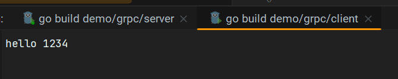

# gRPC 快速开始

## 背景

随着网站需要增加的服务增多，例如订单服务、支付服务等，你不可能将其定制化添加在一个项目中，会带来维护困难、分工开发易冲突等问题，所以需要将这些功能和服务进行横向的分割，包装成高内聚低耦合的功能单元模块，不同的功能单元可以交付给不同的团队进行开发和维护，这些功能单元模块可以部署在不同的机器上，防止单个机器带来限制以及提高并发处理能力。

> 推荐去阅读《大型网站技术架构》，很清晰的讲解了网站架构的历史。

在构建分布式部署和微服务架构的系统时候，会遇到一些问题：

* 语言和平台差异：不同服务可能使用了不同编程语言和平台，在使用时候需要做到兼容性处理。
* 性能和容错问题：有些通信协议和传输方式可能存在一定性能瓶颈，还有可能受到网络故障、服务不可以等因素影响，需要选择合适通信协议和传输方式。
* 精准调用：需要精准去调用某一个服务下的某一个功能，不能够因为某些原因导致调用出错
* ….

还有很多很多问题。问题的解决方法太多太多了，`gRPC` 框架可以很好的解决这些问题。

`gRPC `是一种高性能、开源的远程过程调用框架，基于`HTTP/2`和 `ProtoBuf` 协议，支持多种编程语言，提供了丰富的功能和易于使用的接口，常用于构建分布式部署和微服务架构的系统。

## 调用过程

一个程序（称为客户端）调用另一个程序（称为服务器或远程服务）中的函数，过程如下（这整个过程可以抽象成一个购物订单）：

1. 定义接口（双方地址）：需要确认客户端和服务器之间地址，确认访问对方方式。
2. 客户端调用（找个快递员A）：客户端应用程序调用本地的代理对象（Proxy Object），并传递参数。代理对象具有与服务器接口相同的方法，但实际上并不执行任何功能。
3. 打包参数（打包物品）：客户端代理对象将调用信息和参数打包成网络可传输的格式，例如将它们序列化为二进制数据。
4. 网络传输（快递员骑电动车/摩托车）：打包后的请求通过网络发送到远程服务器。这可能涉及到网络协议、Socket通信、HTTP请求等。
5. 服务器接收（对方在快递柜找到）：服务器接收到请求后，会根据请求中的信息来确定要调用的具体方法。
6. 解包参数（对方拆包裹）：服务器解析接收到的请求，将参数从网络传输的格式还原为本地方法可以理解的形式。
7. 服务器调用（对方使用）：服务器使用解包后的参数调用相应的方法，并执行实际的操作。
8. 打包结果（对方打包使用感受）：服务器将方法的执行结果打包成网络可传输的格式。
9. 网络传输（通过网站或者口头告知）：打包后的结果通过网络发送回客户端。
10. 客户端接收（网站提示店铺）：客户端接收到结果后，将其解包为本地应用程序可以使用的形式。
11. 返回结果（店铺接受）：客户端代理对象将解包后的结果返回给调用方。

其实这过程抽象成实际，你到处都可以看到。在这个过程中双方需要隐藏了底层通信细节，使得分布式系统的开发更加方便和灵活，如何实现？关于实现，这个过程中有很多细节需要细细思考，或许可以从一个原始`demo` 感受下。

## rpc

首先，我们采用原生`rpc`，去实现刚才的过程：

```go
// client.go
package main

import (
	"fmt"
	"net/rpc"
)

func main() {
	//1. 建立连接
	client, err := rpc.Dial("tcp", "localhost:8008")
	if err != nil {
		panic("连接失败")
	}
	// 2.设置结果
	var reply string //string有默认值
	// 3. 进行调用 选择目标函数，传入参数，结果
	err = client.Call("HelloService.Hello", "123456", &reply)
	if err != nil {
		panic("调用失败")
	}
	fmt.Println(reply)
}

```

```go
// server.go
package main

import (
	"net"
	"net/rpc"
)

type HelloService struct{}

func (s *HelloService) Hello(request string, reply *string) error {
	//返回值是通过修改reply的值
	*reply = "hello, " + request
	return nil
}

func main() {
	//1. 实例化一个server
	listener, _ := net.Listen("tcp", ":8008")
	//2. 注册处理逻辑 handler，进行绑定
	_ = rpc.RegisterName("HelloService", &HelloService{})
	//3. 启动服务，获取接受的字符串信息
	conn, _ := listener.Accept() //当一个新的连接进来的时候，
	//4. 根据传递信息,进行处理,并调用函数
	rpc.ServeConn(conn)
}

```

上面两个代码已经实现了远程调用，但是有以下问题存在：

* 使用方式与本地调用有差异，调用方式更加接近本地调用 `.hello("123456")`。
* 双方需要维护一个函数表和地址表，使用上比较麻烦。
* 服务端写起来更加简单点，注册处理函数时候更加方便点（字符串和实体一一对应很容易出现错误）

基于这两个原因，我们进行进一步的升级。

1. 希望调用方式更加接近本地调用 `.hello("123456")`。

思考如何接近本地调用？答：去封装一层专门处理 `rpc` 代码，然后暴露出来，让客户端使用更加贴近本地调用方式。

```go
// client_proxy.go
package client_proxy

import (
	"net/rpc"
)

type HelloServiceStub struct {
	*rpc.Client
}

// 创建初始化对象
func NewHelloServiceClient(protcol, address string) HelloServiceStub {
	conn, err := rpc.Dial(protcol, address)
	if err != nil {
		panic("connect error!")
	}
	return HelloServiceStub{conn}
}

// 将调用方法封装在函数中，就可以实现类似的本地调用
func (c *HelloServiceStub) Hello(request string, reply *string) error {
	err := c.Call("HelloService.Hello", request, reply)
	if err != nil {
		return err
	}
	return nil
}
```

使用方式：

```go
// client.go
package main

import (
	client_proxy "demo/new_rpc/client_porxy"
	"fmt"
)

func main() {
	// 创建服务对象
	client := client_proxy.NewHelloServiceClient("tcp", "localhost:1234")
	var reply string //string有默认值
	// 调用服务中的函数
	err := client.Hello("1234", &reply)
	if err != nil {
		panic("调用失败")
	}
	fmt.Println(reply)
}

```

在客户端使用远程服务方式已经实现了。

2. 希望不要去记忆一些常用的字符串

其实这个挺好实现的，创建一个新的文件，将变量暴露出来，后续都是用变量，而不是字符串了。

```go
// hanlder.go
package hanlder

const HelloServiceName = "handler/HelloService"

```

3. 希望服务端写起来更加简单，减少错误产生。

怎么去封装服务端的注册处理函数？答：`rpc.RegisterName("HelloService", &HelloService{})` 将这个代码的参数进行封装：

* 字符串通过变量去使用
* 对该代码进行封装，只传入实体就可。

```go
// server_proxy.go
func RegisterHelloService(srv HelloService) error {
	return rpc.RegisterName(hanlder.HelloServiceName, srv)
}
```

存在一个问题：`HelloService` 结构体声明和函数的参数类型具有很强的耦合（改了结构体名称，就也要改函数参数的类型）

解决方式：函数参数类型封装成一个接口类型` interface`，根据鸭子类型原理就可以解决这个问题了

```go
// server_proxy.go
package server_proxy

import (
	hanlder "demo/new_rpc/handler"
	"net/rpc"
)

type HelloServicer interface {
	Hello(request string, reply *string) error
}

// 如果做到解耦 - 我们关系的是函数 鸭子类型
func RegisterHelloService(srv HelloServicer) error {
	return rpc.RegisterName(hanlder.HelloServiceName, srv)
}

```

服务端写法：

```go
package main

import (
	"demo/new_rpc/server_proxy"
	"net"
	"net/rpc"
)

type HelloService struct{}

func (s *HelloService) Hello(request string, reply *string) error {
	//返回值是通过修改reply的值
	*reply = "hello, " + request
	return nil
}

func main() {
	//1. 实例化一个server
	listener, _ := net.Listen("tcp", ":8008")
	//2. 注册处理逻辑 handler，进行绑定
	_ = server_proxy.RegisterHelloService(&HelloService{})
	//3. 启动服务，获取接受的字符串信息
	conn, _ := listener.Accept() //当一个新的连接进来的时候，
	//4. 根据传递信息,进行处理,并调用函数
	rpc.ServeConn(conn)
}
```

整体变化不大，只是改了第 `21` 行的代码。

在这里，两个代理文件确实会帮助我们去写业务逻辑代码，写多个功能函数时候，其实都是一样逻辑，大胆的想，可以自动生成吗？同时还有很多地方没有完善，例如跨语言调用等。

其实这些都可以通过`gRPC`来实现。

## gRPC

生成这些文件，需要 `protobuf` 的帮助，入门学习可以参考如下：

* https://juejin.cn/post/7144948875613339685
* https://zhuanlan.zhihu.com/p/435944782

关于环境搭建，请看上一篇《环境搭建》。

1. 首先，需要定义双方实现的功能相关信息：参数、函数名、返回类型等等

```protobuf
syntax = "proto3"; // 定义proto 版本号
option go_package = ".;proto"; //定义 go 包名，用于生成的 .pd.go 文件

service Greeter {  // 定义消息服务，设置rpc接口服务
    rpc SayHello (HelloRequest) returns (HelloReply);
}
// 定义消息体
message HelloRequest {
    string name = 1;
}
// 定义消息体
message HelloReply {
    string message = 1;
}
```

2. 自动生成文件

```shell
protoc -I . hello.proto --go_out=plugins=grpc:. 
```

3. 服务端代码

```go
//定义一个结构体，作用是实现helloworld中的GreeterServer
type Server struct{}
// 相关业务函数
func (s *Server) SayHello(ctx context.Context, request *proto.HelloRequest) (*proto.HelloReply,
	error) {
	return &proto.HelloReply{
		Message: "hello " + request.Name,
	}, nil
}

func main() {
    //1.实例化gRPC服务
	g := grpc.NewServer()
    //2. 服务注册
	proto.RegisterGreeterServer(g, &Server{})
    // 3. 监听端口
	lis, err := net.Listen("tcp", "0.0.0.0:50051")
	if err != nil {
		panic("failed to listen:" + err.Error())
	}
    //4. 启动服务
	err = g.Serve(lis)
	if err != nil {
		panic("failed to start grpc:" + err.Error())
	}
}

```

4. 客户端代码

```go
func main() {
	//1. 建立服务连接
	conn, err := grpc.Dial("127.0.0.1:50051", grpc.WithTransportCredentials(insecure.NewCredentials()))
	if err != nil {
		panic(err)
	}
    // 2.关闭服务
	defer conn.Close()
	// 3. 实例化客户端连接
	c := proto.NewGreeterClient(conn)
    //4. 客户端调用在proto中定义的SayHello()rpc方法，发起请求，接收服务端响应
	r, err := c.SayHello(context.Background(), &proto.HelloRequest{Name: "1234"})
	if err != nil {
		panic(err)
	}
	fmt.Println(r.Message)
}
```

5. 运行结果



### 流

`grpc`的 stream (流) 主要用于传输一些大数据，或者服务端和客户端长时间数据交互，比如聊天机器人。所具备流模式如下：

1. 服务端数据流

这种模式是客户端发起一次请求，服务端返回一段连续的数据流。典型的例子是客户端向服务端发送一个股票代码，服务端就把该股票的实时数据源源不断的返回给客户端。

2. 客户端数据流

这种模式是客户端源源不断的向服务端发送数据流，而在发送结束后，由服务端返回一个响应。典型的例子是物联网终端向服务器报送数据。

3. 双向数据流

这种模式是客户端和服务端都可以向对方发送数据流，这个时候双方的数据可以同时互相发送，也就是可以实现实时交互。典型的例子是聊天机器人。

实现代码：

`protobuf` 文件

```protobuf
syntax = "proto3";

option go_package = ".;proto"; 
service Greeter {
    rpc GetStream(StreamReqData) returns (stream StreamResData); //服务端流模式
    rpc PutStream(stream StreamReqData) returns (StreamResData); //客户端流模式
    rpc AllStream(stream StreamReqData) returns (stream StreamResData); //双向流模式
}

message StreamReqData {
    string data = 1;
}

message StreamResData {
    string data = 1;
}
```

```go
func main() {
	conn, err := grpc.Dial("localhost:50052", grpc.WithInsecure())
	if err != nil {
		panic(err)
	}
	defer conn.Close()
	//服务端流模式
	c := proto.NewGreeterClient(conn)
	res, _ := c.GetStream(context.Background(), &proto.StreamReqData{Data: "1234"})
	for {
		a, err := res.Recv() 
		if err != nil {
			fmt.Println(err)
			break
		}
		fmt.Println(a.Data)
	}

	//客户端流模式
	putS, _ := c.PutStream(context.Background())
	i := 0
	for {
		i++
		_ = putS.Send(&proto.StreamReqData{
			Data: fmt.Sprintf("1234%d", i),
		})
		time.Sleep(time.Second)
		if i > 10 {
			break
		}
	}

	//双向流模式
	allStr, _ := c.AllStream(context.Background())
	wg := sync.WaitGroup{}
	wg.Add(2)
	go func() {
		defer wg.Done()
		for {
			data, _ := allStr.Recv()
			fmt.Println("收到客户端消息：" + data.Data)
		}
	}()

	//1. 集中学习protobuf， grpc

	go func() {
		defer wg.Done()
		for {
			_ = allStr.Send(&proto.StreamReqData{Data: "312"})
			time.Sleep(time.Second)
		}
	}()

	wg.Wait()
}
```

```go
package main

import (
	"OldPackageTest/stream_grpc_test/proto"
	"fmt"
	"google.golang.org/grpc"
	"net"
	"sync"
	"time"
)

const PORT = ":50052"
// 定义一个结构体，实现三种数据流的业务逻辑
type server struct {
}

func (s *server) GetStream(req *proto.StreamReqData, res proto.Greeter_GetStreamServer) error {
	i := 0
	for {
		i++
		_ = res.Send(&proto.StreamResData{
			Data: fmt.Sprintf("%v", time.Now().Unix()),
		})
		time.Sleep(time.Second)
		if i > 10 {
			break
		}
	}

	return nil
}

func (s *server) PutStream(cliStr proto.Greeter_PutStreamServer) error {
	for {
		if a, err := cliStr.Recv(); err != nil {
			fmt.Println(err)
			break
		} else {
			fmt.Println(a.Data)
		}
	}

	return nil
}

func (s *server) AllStream(allStr proto.Greeter_AllStreamServer) error {
	wg := sync.WaitGroup{}
	wg.Add(2)
	go func() {
		defer wg.Done()
		for {
			data, _ := allStr.Recv()
			fmt.Println("收到客户端消息：" + data.Data)
		}
	}()

	go func() {
		defer wg.Done()
		for {
			_ = allStr.Send(&proto.StreamResData{Data: "我是服务器"})
			time.Sleep(time.Second)
		}
	}()

	wg.Wait()
	return nil
}

func main() {
    // 创建连接
	lis, err := net.Listen("tcp", PORT)
	if err != nil {
		panic(err)
	}
    //实例化grpc服务
	s := grpc.NewServer()
    //服务注册
	proto.RegisterGreeterServer(s, &server{})
	//启动服务
    err = s.Serve(lis)
	if err != nil {
		panic(err)
	}
}

```

## 问题

1. 通过生成 `.pb.go` 文件时候，总是报错。

报错信息：

```shell
--go_out: protoc-gen-go: plugins are not supported; use 'protoc --go-grpc_out=...' to generate gRPC

See https://grpc.io/docs/languages/go/quickstart/#regenerate-grpc-code for more information.
```

解决方法：https://blog.51cto.com/u_15619895/5259902
