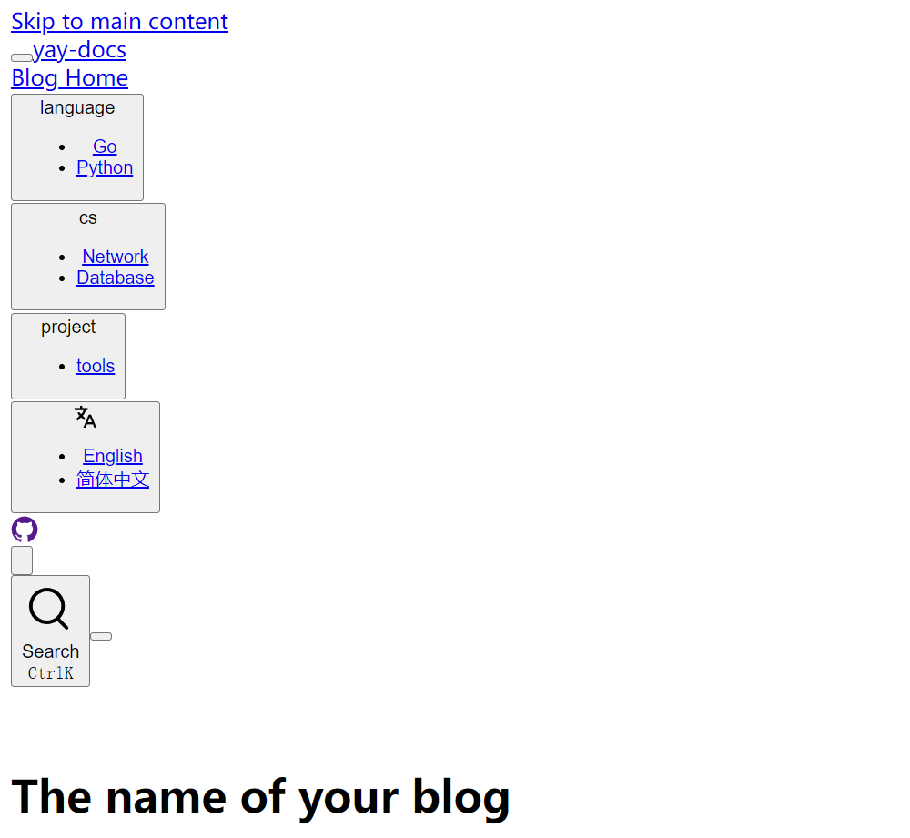

# Github Action

## 基本介绍

GitHub Actions 是一种持续集成和持续交付 (CI/CD) 平台，可以执行一些操作，例如运行测试、打包并部署、发布项目等，你也不用写很复杂得脚本去实现，直接引用别人写好的 action 最后组成一个 actions 组合来达到你的目的。

[官方文档](https://docs.github.com/zh/actions/quickstart)

## 相关部分

### workflow 工作流

工作流可运行一个或者多个任务，你可以自己设定触发机制，自动触发或者手动触发。

工作流存储在 `.github/workflows` 文件夹中，以 `yaml` 格式进行配置，一个 `yaml` 代表一个工作流。

### event 事件

设置触发工作流运行得特定机制，例如当有人在仓库中提交文件，需要重新对项目进行打包并部署，那么你需要将触发机制设置为 `push` 操作。

在 `yaml` 文件中你需要配置得是 `on`。

举个例子：我现在需要配置只要仓库有 `push` 操作就会运行该工作流。

```yaml
on:
  # 触发条件，这里设置为 push，也就是只有在 push 时才会触发
  push:
    branches:
      # 确保这是你正在使用的分支名称
      - main
```

触发事件有很多，你可以参考[官方文档](https://docs.github.com/zh/actions/using-workflows/events-that-trigger-workflows#about-events-that-trigger-workflows)进行选择。

> 注意：不一定所有事情都是用于触发机制，也有设置上下文操作得。

### job 任务

任务是工作流中在同一运行器中执行得一组步骤。每个步骤按顺序执行得。你也可以去配置任务与其他任务之间得关系，设置条件或者并发运行等。

在 `yaml` 文件中是如下配置：

```yaml
jobs:
	# 第一个 job 的 id
  deploy-pages:
  	name: # job 名称
  	runs-on: # 运行环境：window/Ubuntu/macOS等
  	if: # 设置条件
  	steps: # 设置步骤
  	...还有很多配置
```

相关的配置请参考官方文档。

### step 步骤

就是你要干的动作/活动，你可以运行相关命令，或者选择其他的 `action` 进行运行等。

```yaml
      steps:
        - name: # 名称
          run: # 运行命令
          env: # 设置一些环境变量
          uses: # 选择合适 action 进行执行
          	with: # action的一些配置
```

## 实例部署

> 场景：使用 `Github Action` 对 `vuepress` 项目进行打包并部署

在 `.github/workflows` 文件夹中创建一个 `yaml` 文件。

相关配置如下：

```yaml
name: 部署文档

on:
  workflow_call:
    secrets:
      # 获取 ACCESS_TOKEN 权限
      ACCESS_TOKEN:
        required: true
  # 触发条件，这里设置为 push，也就是只有在 push 时才会触发
  push:
    branches:
      # 确保这是你正在使用的分支名称
      - main

jobs:
  deploy-pages:
    runs-on: ubuntu-latest # 设置运行环境
    # 接下来的步骤
    steps:
      # 检查并获取仓库源码，包括子模块
      - name: Checkout
        uses: actions/checkout@v3
        with:
          fetch-depth: 0
          # 如果你文档需要 Git 子模块，取消注释下一行
          submodules: true
      # 设置 Node.js 环境
      - name: Set up Node.js
        uses: actions/setup-node@v3
        with:
          node-version: 18
      # 安装 pnpm
      - name: Install pnpm
        run: npm install -g pnpm
      # 安装依赖
      - name: Install dependencies
        run: pnpm install --no-frozen-lockfile
      # 打包并构建文档
      - name: 构建文档
        env:
          NODE_OPTIONS: --max_old_space_size=8192
        run: |-
          pnpm run docs:build
      # 创建 CNAME 文件，设置自定义域名
      - name: Create CNAME
        run: |
          echo "yay-docs.yangdiy.cn" > CNAME
          mv CNAME src/.vuepress/dist

      # 查看 workflow 的文档来获取更多信息
      # @see https://github.com/crazy-max/ghaction-github-pages
      # 部署到 GitHub Pages
      - name: Deploy to GitHub Pages
        uses: crazy-max/ghaction-github-pages@v2
        with:
          # 部署到 gh-pages 分支
          target_branch: gh-pages
          # 部署目录为 VuePress 的默认输出目录
          build_dir: src/.vuepress/dist
        env:
          # @see https://docs.github.com/cn/actions/reference/authentication-in-a-workflow#about-the-github_token-secret
          GITHUB_TOKEN: ${{ secrets.ACCESS_TOKEN }}

```

这里需要设置 `ACCESS_TOKEN`，步骤如下：

* 在 `个人账号->setting-> Developer settings-> Personal access tokens->Tokens` 里面进行创建 `Token` ，关于权限的选择，选择关于 `workflows & repo` 就可以了，设置相关的期限。
* 在 `个人仓库-> Settings-> Secrets and variables-> Actions ` 里面填写刚才的 `Token` 。注意：名称要与文件内容保持一致。

### 问题

1. 自定义域名后，页面没有样式，如下图所示：



解决方案：

这与你的部署域名有关系，需要修改的配置 [base选项](https://<USERNAME>.github.io/)

* 如果你的域名是 `https://<USERNAME>.github.io/` 或者 自定义域名，你需要将 `base` 设置成 `/`
* 如果你的域名是 `https://github.com/<USERNAME>/<REPO>` ，你需要将 `base` 设置成 `/<REPO>/`

> 注意：`base` 的斜杠数量和方向

2. 项目配置为自己 `GitHub pages`  自定义域名

场景：在部署时候，每次工作流生成的打包文件会覆盖之前，所以项目的域名总是 `GitHub Pages` 默认域名，但是我希望他是一个自定义域名。

解决方案：

本质上你通过 `github pages` 设置的自定义域名就是在你的项目中加入了一个 `CNAME` 文件，文件内容是你的域名。基于该原因有这样以下的解决方案：

* 利用 `Git` 进行提交
* 打包后加入文件

第一种方案会遇到权限问题，总是会报如下错：

```shell
remote: Permission to baici1/yay-docs.git denied to github-actions[bot].
fatal: unable to access 'https://github.com/baici1/yay-docs.git/': The requested URL returned error: 403
```

第二种方案就比较简单，加入以下代码即可实现：

```yaml
      - name: Create CNAME
        run: |
          echo "yay-docs.yangdiy.cn" > CNAME
          mv CNAME src/.vuepress/dist
```

## 参考

https://www.ruanyifeng.com/blog/2019/09/getting-started-with-github-actions.html

https://docs.github.com/en/actions/quickstart
